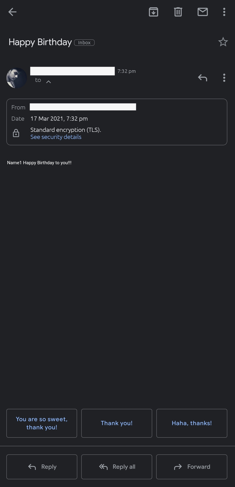

<div align="center">
  <h1>🎂 Auto Birthday Wisher</h1>
  <p><i>Never miss a special moment again! Automate your birthday greetings via Python.</i></p>
  
  
</div>

<hr>

## 📌 Project Overview
This script automates sending birthday emails to friends and family. It scans your `data.xlsx` file daily and sends a personalized message if a birthday matches today's date.

### ✨ Key Features
* **Automated Scheduling:** Set it and forget it.
* **Custom Messages:** Unique "Dialogues" for each person in your list.
* **Excel Integration:** Manage contacts easily via Spreadsheet.
* **Secure Delivery:** Uses SMTP with TLS encryption.

<hr>

## 🛠️ Setup & Installation

1. **Install Dependencies:**
   ```bash
   pip install pandas openpyxl

<p align="center">
Made with ❤️ by <a href="https://github.com/itskashfur">Kashfur Rahman</a>
</p>
